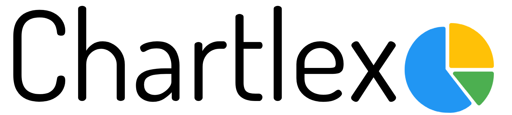
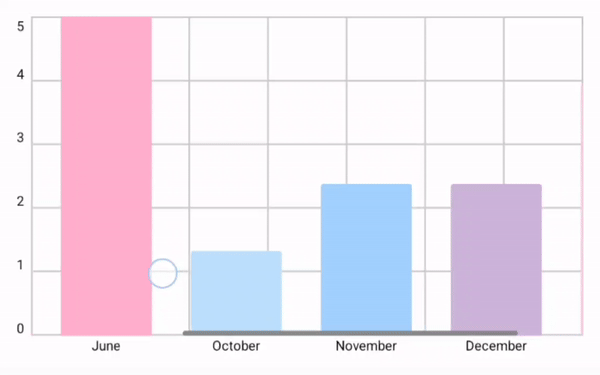
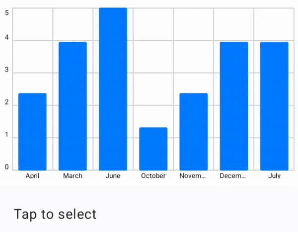
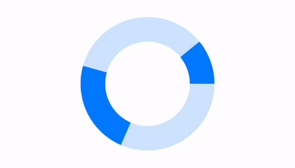
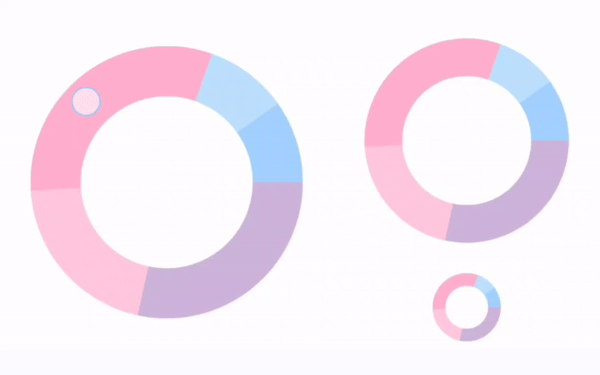

# Kotlin Compose Charts

Temporary repository for the source code of a project that will soon be published as a charts library for Kotlin Compose. 
Main goal of the library is to provide developers with an easy-to-learn, convenient and powerful tool for displaying graphs.

## Examples

### Bar Charts

### Donut Charts

